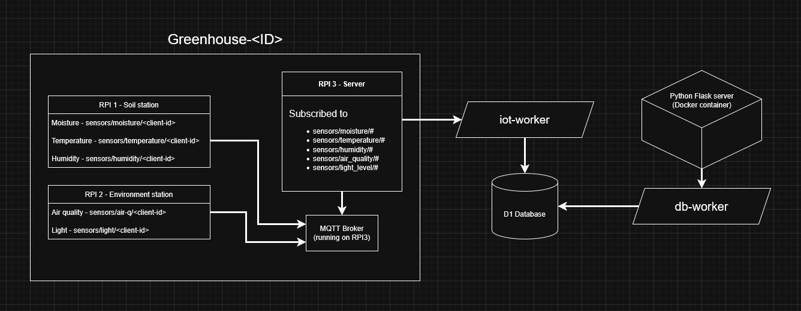

# IOT project
Smart Greenhouse / Terrarium Network 



Concept: Create a self-regulating miniature ecosystem distributed across three zones (the Pis).

Pi Roles:

    Pi 1 (Soil Station): Uses Soil Moisture Sensor and Temperature/Humidity Sensor (DHT). Publishes local environment data.

    Pi 2 (Air & Light Station): Uses Air Quality Sensor and Light Sensor. Publishes atmospheric data.

    Pi 3 (Control & Broker): Runs the Mosquitto MQTT Broker, subscribes to all sensor data, and uses a Relay to control a simulated device (e.g., a fan or pump connected to the relay) based on thresholds from Pi 1 and Pi 2.

Scalability: Easily add more "zones" (new Pis) or more types of sensors (e.g., pH, UV) to the system without changing the central control logic.

## RPI roles
### RPI 1 - 172.16.33.31 (red)
The first RPI will be in control of the sensors close to the plants. Here there will be a soil moisture, a Temperature and a Humidity sensor.

### RPI2 - 172.16.33.32 (purple)
The second RPI will be in control of the general environment of the greenhouse. It will hold the air quality sensor and the sun light sensor.

### RPI3 - 172.16.33.25 (black)
The third and last RPI will be in charge of the communication and logic. It will act as the broker for MQTT. This will subscribe to all sensors and collect the data.

## Sensors
- Temperature/Humidity Sensor
- Air pressure Sensor
- Light Sensor

## Actuators
- "Fan"

# Setup
Create a general python venv in root folder of project
```
python3 -m venv .venv
```

Activate it 
```
. .venv/bin/activate (linux)
.\.venv\Scripts\Activate.ps1 (Powershell)
```

Install packages
```
pip3 install -r requirements.txt
```

## Structure so far
### Cloudflare workers
We have 2 Cloudflare workers running at the moment, one is in charge of inserting data into the database from the server running on RPI3. The second worker is in charge of getting the data from the database for displaying on the website running in a container on Google cloud

#### iot-worker
The iot-worker (https://iot-worker.mathiasen-simon.workers.dev) is the worker that takes a body of data from the server running on the RPI3. The body of the data should look something like this:
```
{
    "greenhouse-1" : {
        "rpi-1" : {
            "temp_celsius": 24.5,
            "humidity_percent": 65.2,
            "soil_moisture": 450
           
        },
        "rpi-2" : {
            "air_quality": "Good",
            "light_level": 65.2
        }

    },

    "greenhouse-2" : {
        "rpi-1" : {
            "temp_celsius": 30.5,
            "humidity_percent": 25.2,
            "soil_moisture": 850
        },
        "rpi-2" : {
            "air_quality": "Bad",
            "light_level": 15.2
        }
    }
}
```
Here we can dynamically add more greenhouses by adding more blocks. These blocks of sensor reading are constructed on the RPI3.

#### db-worker
The db-worker (https://db-worker.mathiasen-simon.workers.dev/) is very simple it just fetches the data from the D1 database and returns it as a JSON body for the Flask server running in the container to parse and display on a website.

### Container
There is 1 container (https://iot-server-149967229252.europe-west1.run.app/) running in Google cloud which is the web interface that displays the sensor data and such to the user. This is a simple Flask server that just calls the db-worker to get the most recent data, or in case of analytics a history of data.

### D1 Database
There is 1 D1 database running on Cloudflare which stores all the reading from the sensors, in theory this should store all of the history but I don't want to pay for storage so we just use basic examples to showcase.

